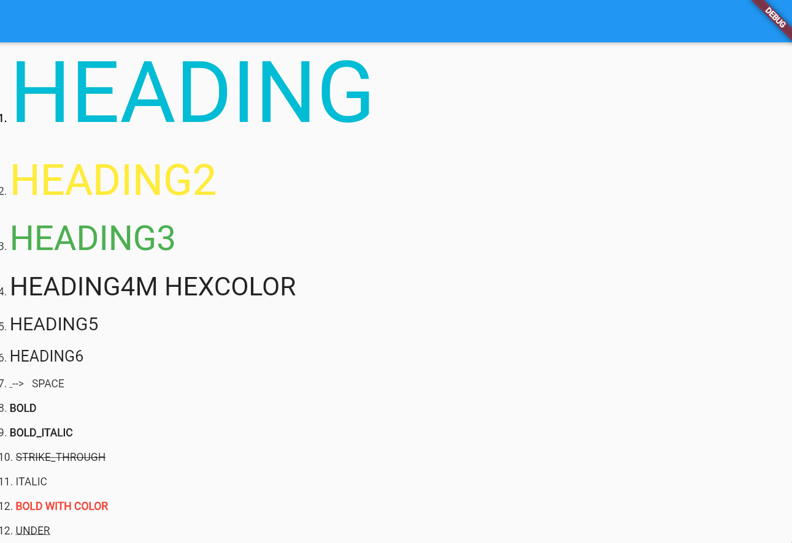

<!-- 
This README describes the package. If you publish this package to pub.dev,
this README's contents appear on the landing page for your package.

For information about how to write a good package README, see the guide for
[writing package pages](https://dart.dev/guides/libraries/writing-package-pages). 

For general information about developing packages, see the Dart guide for
[creating packages](https://dart.dev/guides/libraries/create-library-packages)
and the Flutter guide for
[developing packages and plugins](https://flutter.dev/developing-packages). 
-->
A widget that display text like markdown with own tags

## Features
1. 
<!--  -->
2. If u want to use only text u can use it
## Getting started

If you want to hightlight text you can use this package
for more information plz check on github repo
## Usage


```dart
return Scaffold(
      appBar: AppBar(),
      body: const FuncyRichText(
        text: """
**//black//1.** #//cyan//HEADING# \n
2. ##//yellow//HEADING2## \n
3. ###//green//HEADING3### \n
4. ####//#232323//HEADING4M<__>HEXCOLOR#### \n
5. #####HEADING5##### \n
6. ######HEADING6###### \n
7. <--/__/--> --> <__> SPACE \n
8. **BOLD** \n
9. ***BOLD_ITALIC*** \n
10. ~STRIKE_THROUGH~ \n
11. *ITALIC* \n
12. **//red//BOLD<__>WITH<__>COLOR** \n
12. _UNDER_LINE_ \n

        """,
      ),
    );
```
###PATTERN
```
1. color //red// //#ffffff//
2. bold **TEXT**
3. italic *TEXT*
4. heading1 #TEXT#
5. <__> white space
6. boldItalic ***TEXT***
7. heading2 ##TEXT##
8. heading3 ###TEXT###
9. heading4 ####TEXT####
10. heading5 #####TEXT#####
11. heading6 ######TEXT######
12. strikeThrough ~TEXT~
13. underLine _TEST_


```

- [ ] TODO add escape tags
- [x] whitespace done  
##INFO
All texts were splitted by white space  eg.`  "*HELLO* **WORD**"`
It will decorate *HELLO* AND **WORD**
If you want to ingore the space use`<__> *HELLO<__>WORLD*`
**HELLO WORLD**


